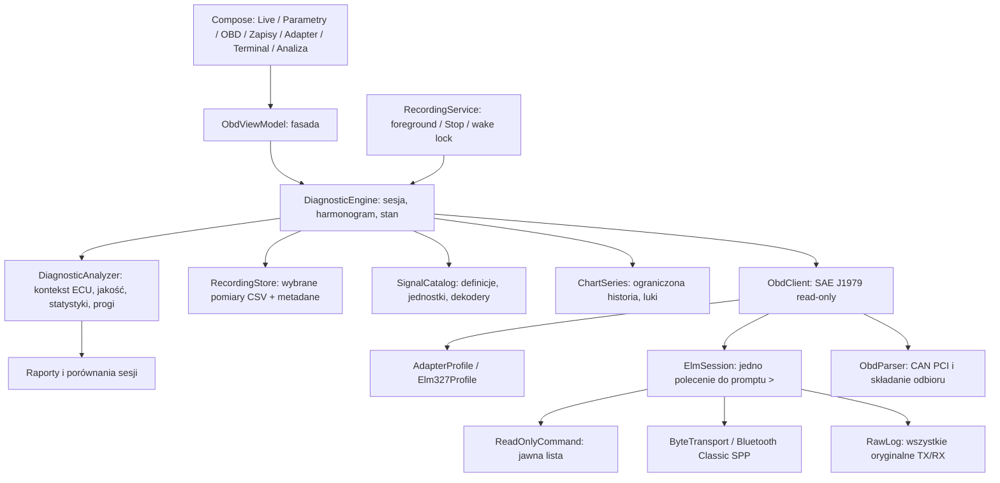

# Architektura 0.4 — read-only telemetry

## Moduły i cykl życia

- core (JVM): whitelist, kolejka ELM, profile, abstrakcja transportu, parsery, SignalCatalog, J1979, Readiness, ChartSeries, CSV serializer, demo i testy.
- transport-bluetooth (Android): secure RFCOMM SPP; zamknięcie przerywa blokujące I/O. Bez reflection channel fallback i bez aktywnego skanowania.
- app: DiagnosticEngine należący do Application, foreground RecordingService, zapis/eksport plików, preferencje, Compose i ViewModel fasada.

ViewModel nie zamyka aktywnej sesji przy utracie Activity. Widoczność Activity wstrzymuje zwykły Live, ale nie zapis utrzymywany przez foreground service. Usługa zaczyna się wyłącznie od jawnej akcji użytkownika w widocznej aplikacji. connectedDevice wymaga odpowiednich uprawnień Bluetooth. Brak restartu po zabiciu procesu; przerwany plik pozostaje możliwy do eksportu.

## Dwie selekcje

liveIds wybiera karty/wykresy. recordIds wybiera CSV i jest zamrożony podczas nagrywania. Polling bierze sumę liveIds i recordIds tylko przy aktywnym zapisie, filtruje przez bitmapy ECU i deduplikuje PID-y. Dwa sygnały PID 34 są obliczane z jednej odpowiedzi. ATRV ma osobną ścieżkę tekstową i jest opisany jako napięcie adaptera.

Definicje signal_id nie zależą od nazw w UI. Klucz historii to ECU:signal_id. Dane są rozdzielane według ECU, bez scalania sond/sterowników. Preferencje wyboru, okna wykresów i celu szybkich odczytów są trwałe.

## Harmonogram i błędy

Każda instancja ElmSession ma jeden reader i FIFO Mutex kolejki. Następna transmisja dopiero po `>`. Początek sesji to ATZ, nigdy pusty CR powtarzający nieznane poprzednie polecenie. Po timeoutcie/EOF/anulowaniu komendy sesja zamyka socket i odrzuca czekające polecenia. RawLog zachowuje wszystkie bajty przed parsowaniem; bufor pojedynczej odpowiedzi ma limit 256 KiB.

DiagnosticEngine ma dodatkowy Mutex całych operacji. OBD VIN/DTC/Readiness nie przeplatają swoich poleceń z pollingiem. Ustawienie busy kończy bieżącą komendę/część cyklu; skan uzyskuje blokadę i polling wraca po jej zwolnieniu. CSV nie jest kończony z powodu skanu. Generacja sesji i anulowanie prac uniemożliwiają użycie starego klienta po reconnect.

PollingScheduler wybiera jedną należną komendę według najwcześniejszego terminu i zachowuje minimum 80 ms po odczycie. Szybkie PID-y mają cel ustawiany przez użytkownika; średnie 5 s, wolne 60 s. Terminy nie są obietnicą stałego Hz. Każdy PID ma własny backoff po błędach. Mutex operacji jest zwalniany po pojedynczym odczycie. Skan VIN/DTC otrzymuje blokadę na całą operację.

Niepoprawna odpowiedź usuwa bieżący Sample, dodaje null do historii i zapisuje pustą wartość CSV ze statusem. ChartSeries dzieli linię po brakach i większych odstępach; nie interpoluje braków jako zero. Historia jest ograniczona do 2000 punktów na sygnał. Wykresy mają własne jednostki/skale.

## Pliki

RecordingStore dopisuje tylko zaznaczone sygnały w długim formacie CSV. Każdy wiersz ma UTC, czas od początku, ECU, id, nazwę, wartość, jednostkę, status i opóźnienie. Statusy NO_DATA/INVALID/ERROR nie mają wartości liczbowej. JSON obok pliku przechowuje stan/wybór/ilość danych. Po nieczystym zakończeniu odbudowuje się licznik wierszy i status interrupted.

Eksport robi migawkę pod blokadą pliku, potem zapisuje do document provider poza blokadą. Surowy TSV jest osobnym logiem całej transmisji. Nie ma automatycznego usuwania ani limitu plików na dysku. App nie ma INTERNET; eksport SAF wybiera użytkownik. Błąd zapisu CSV kończy nagrywanie; błąd surowego logu kończy sesję ELM.

## Dalsze warstwy

AdapterProfile może otrzymać potwierdzone rozszerzenia vLinker/OBDLink bez modyfikowania UI. Binary CAN transport może implementować DiagnosticChannel. Obecne składanie SF/FF/CF jest parserem odbioru, nie pełnym transportem ISO-TP. UDS/VAG wymagają własnych typowanych odczytów, kontroli adresowania/NRC i definicji ECU/DID opartych na rzeczywistym sterowniku. Te usługi nie są jeszcze dopuszczone w ReadOnlyCommand.

Nie wdrożono SecurityAccess, SessionControl, RoutineControl, IOControl, kodowania, adaptacji, zapisów ani dowolnej transmisji CAN. Rozszerzenie rejestratora zapisuje dane wyłącznie lokalnie na telefonie.

## Analiza 0.3

DiagnosticAnalyzer (JVM) utrzymuje statystyki online per ECU/signal_id bez przechowywania wszystkich próbek. Ma reguły o jawnych warunkach, podtrzymanie, histerezę, reset po luce i limity historii. RPM jako kontekst pochodzi wyłącznie z tego samego ECU; nie łączy się Adapter:ATRV z napięciem ECU ani wielu adresów odpowiedzi. Kontekst Live nie zwiększa zakresu CSV. Oznaczenie zapłonu i progi są adnotacjami użytkownika, niezależnymi od transportu. Brak modelu wnioskowania o awarii producenta z ogólnych PID-ów.

RecordingStore ma własny analizator ograniczony do wybranych pomiarów oraz kontekstu RPM. Markdown jest zapisywany przy końcu sesji; otwarty raport generuje się pod lock. Starsze lub przerwane CSV odtwarza się strumieniowo do samych statystyk, bez retroaktywnego wymyślania ustawień/alertów. Porównanie jawnie pokazuje różne zakresy pomiarów i nie łączy sesji demo z fizycznymi.

Health polling PID 0101 co 30 s korzysta z tej samej operacyjnej blokady i kolejki promptów; nie ma osobnego równoległego kanału ECU. Mil/readiness bez poprawnej odpowiedzi są usuwane z bieżącego stanu. Status jest snapshotem, nie gwarancją stanu pomiędzy odczytami.

## Rozszerzenia 0.4

PidScaling przechowuje konfigurację 4F per ECU. SignalCatalog filtruje maski sensorów dopiero po sprawdzeniu pełnej długości. Nie ma dekodowania częściowego wieloramkowych danych. DtcScan rozdziela czas, tryby, ECU i statusy. RecordingStore zapisuje trwałą historię DTC w JSONL oraz eksportuje spójną migawkę ZIP pod blokadą dopisywania plików. Analyzer rozróżnia UNSUPPORTED i braki oraz przechowuje osobny limit świeżości przy każdym pomiarze/regule. Skan DTC przy rozpoczęciu nagrywania i okresowy współdzielą kolejkę; brak osobnego ruchu CAN.
